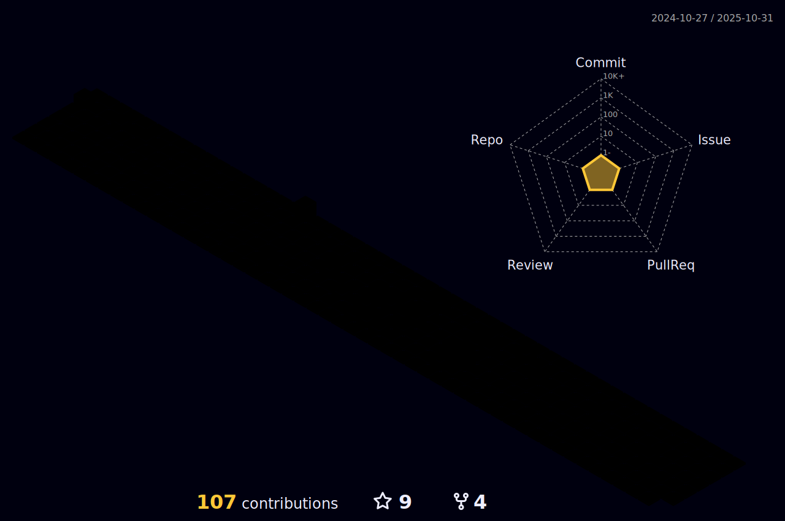

  

Full-Stack Software Engineer, currently at Holberton School.

Focused on learning all things Machine Learning(ML) and Cloud database design.

Follow me or reach out to talk about SDLC, Full-Stack Development, ML, Cloud DBs, or any Tech-related stuff.

  

### Tech & Tools Preference
   

#### Languages by commits

	

---
### Github commit stats

